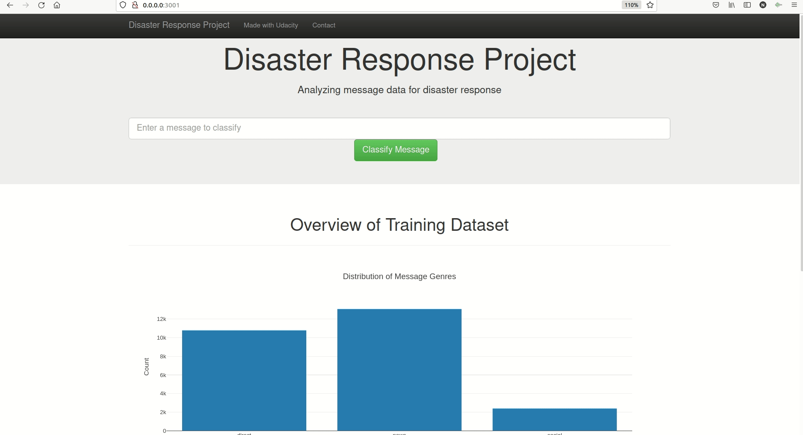

# Udacity-Data-Scientist-Nanodegree-Assignment-2

This repo contains code to classify text messages received during a disaster
into various categories. This project has been done as part of Udacity
Datascientist Nanodegree program. 

<br/><br/>



<br/><br/>

**Directory Structure**

```
.
├── app
│   ├── run.py
│   └── templates
│       ├── go.html
│       └── master.html
├── data
│   ├── disaster_categories.csv
│   ├── disaster_messages.csv
│   ├── DisasterResponse.db
│   └── process_data.py
├── models
│   └── train_classifier.py
├── DisasterResponse.db
├── ETL Pipeline Preparation.ipynb
├── ML Pipeline Preparation.ipynb
├── ML Pipeline with TFIDF.ipynb
├── ML Pipeline with TFIDF & Tuning.ipynb
├── Model Output Test.ipynb

├── README.html
├── README.md
└── Visualize data.ipynb

```

There are 3 parts of the repo:  

  1. **Data processing (ETL) pipeline**: **data/process_data.py** : Cleans the text data, converts it into features
  that are fit for the machine learning pipeline and stores the data into a sqlite database.
  
  2. **Machine learning pipeline**: **models/train_classifier.py** : Runs the data through the machine learning model which generates predictions for categories for the data.
  
  3. **Flask Webapp**: **app/run.py** : User can enter a text message and the app would display the categories that the message belongs to as predicted by the machine learning model. 

**Usage**  

1. **Build the model**: Since the model is too large to be uploaded here, it would
need to be built again to run the app successfully. So go to the models folder,
open a terminal and run the following:
```
python train_classifier.py ../data/DisasterResponse.db classifier.pkl
```
  The model will take a while to train, depending on your compute power. 
  Once the model is built and saved as a pkl file, you can now run the app: 
  
2. **Run the app**: Go to the app folder, open a terminal and run the following:
```
python run.py
```

**Acknowledgements**  
    1. [Udacity DataScientist Nanodegree Program](https://classroom.udacity.com/nanodegrees/nd025/)  